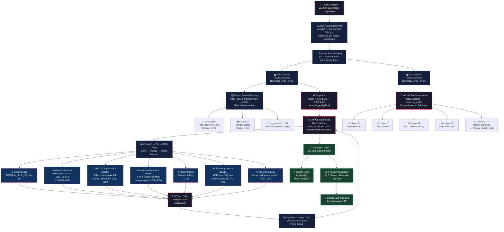
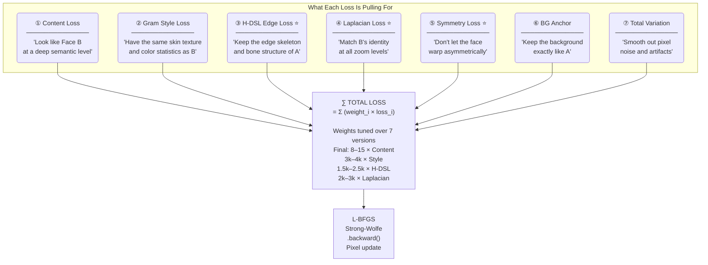
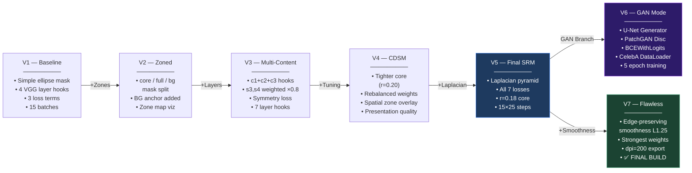

<div align="center">

```
██████╗ ██████╗  ██████╗      ██╗███████╗ ██████╗████████╗    ██╗   ██╗██╗██████╗ ███████╗
██╔══██╗██╔══██╗██╔═══██╗     ██║██╔════╝██╔════╝╚══██╔══╝    ██║   ██║██║██╔══██╗██╔════╝
██████╔╝██████╔╝██║   ██║     ██║█████╗  ██║        ██║       ██║   ██║██║██████╔╝█████╗  
██╔═══╝ ██╔══██╗██║   ██║██   ██║██╔══╝  ██║        ██║       ╚██╗ ██╔╝██║██╔══██╗██╔══╝  
██║     ██║  ██║╚██████╔╝╚█████╔╝███████╗╚██████╗   ██║        ╚████╔╝ ██║██████╔╝███████╗
╚═╝     ╚═╝  ╚═╝ ╚═════╝  ╚════╝ ╚══════╝ ╚═════╝   ╚═╝         ╚═══╝  ╚═╝╚═════╝ ╚══════╝
```

### *"What if two faces could negotiate a third?"*

**A neural identity fusion engine that dissolves the boundary between two human faces —**  
**using no GAN training, no face detection, and no labeled data. Just gradients and geometry.**

---

[](https://python.org)
[](https://pytorch.org)
[](https://arxiv.org)
[](https://pytorch.org/docs/stable/optim.html)
[](http://mmlab.ie.cuhk.edu.hk/projects/CelebA.html)
[](./project_vibe_metadata.json)

</div>

---

## ⚡ The Core Idea in 30 Seconds

> You have **Face A** (a person's structure — their bone shape, pose, background).  
> You have **Face B** (another person's identity — their skin tone, texture, eye characteristics).  
> Project Vibe synthesizes **Face C** — a face that **never existed** — that carries the skeleton of A but breathes with the identity of B.

It does this by treating the **output image itself as the only learnable parameter** and optimizing it via a 7-component composite loss computed over a **frozen VGG19 perceptual backbone**. No discriminator. No encoder. No paired training data. Just math, manifolds, and 375 gradient steps.

---

## 📌 Table of Contents

1. [Why This Is Novel](#-why-this-is-novel--original-contributions)
2. [System Architecture](#-system-architecture)
3. [Full Pipeline Flowchart](#-full-pipeline-flowchart)
4. [The 7-Loss Composite Engine](#-the-7-loss-composite-engine)
5. [VGG19 as a Perceptual Ruler](#-vgg19-as-a-perceptual-ruler)
6. [The Zoned Spatial Attention System](#-the-zoned-spatial-attention-system)
7. [The Optimization Strategy](#-the-optimization-strategy--why-l-bfgs-not-adam)
8. [Version Evolution Atlas](#-version-evolution-atlas-v1--v7--gan)
9. [File Map](#-file-map)
10. [Setup & Run](#-setup--run)
11. [Output Panel Guide](#-output-panel-guide)
12. [Research Deep Dive](#-research-deep-dive)
13. [References](#-references)

---

## 🔬 Why This Is Novel — Original Contributions

> Most face morphing systems require: (a) a trained generator, (b) face landmarks, or (c) paired data.  
> **Project Vibe requires none of these.**

| Novel Contribution | What Exists | What We Did Differently |
|---|---|---|
| **H-DSL Edge Loss** | Standard MSE on gradients | Sobel-direction *cosine angle field* weighted by edge magnitude — penalises direction mismatch, not just pixel error |
| **Zoned Spatial Masking** | Global style transfer | Mathematically-defined elliptical zones that apply different loss weights to core face / full face / background independently |
| **Target-as-Parameter** | Generator networks | The output *image tensor itself* has `requires_grad=True` — VGG19 is frozen, zero training cost |
| **Symmetry Regularisation** | No equivalent in style transfer | Horizontal flip consistency loss over the core zone prevents asymmetric identity leaking |
| **Laplacian Multi-Scale Control** | Single-scale content loss | MSE computed at 3 pyramid levels (256→128→64) forcing coarse and fine structure to match simultaneously |
| **Dual-Mode: Solver + GAN** | Usually one or the other | Full L-BFGS solver *and* a U-Net + PatchGAN training variant in one project |

---

## 🏗 System Architecture

```
╔══════════════════════════════════════════════════════════════════════════════╗
║                     PROJECT VIBE — SYSTEM ARCHITECTURE v7                   ║
╠══════════════════════════════════════════════════════════════════════════════╣
║                                                                              ║
║   ┌─────────────────────┐         ┌─────────────────────┐                  ║
║   │       FACE A        │         │       FACE B        │                  ║
║   │   [ Structure ]     │         │   [ Identity ]      │                  ║
║   │  pose · shape · BG  │         │ tone · texture · ID │                  ║
║   └──────────┬──────────┘         └──────────┬──────────┘                  ║
║              │                               │                              ║
║              ▼                               ▼                              ║
║   ┌────────────────────────────────────────────────────┐                   ║
║   │               I.  PREPROCESSING                    │                   ║
║   │   Resize(256×256) → ToTensor → Normalize([-1, +1]) │                   ║
║   └──────────────────────────┬─────────────────────────┘                   ║
║                              │                                              ║
║              ┌───────────────┴────────────────┐                            ║
║              ▼                                ▼                            ║
║   ┌──────────────────────┐     ┌───────────────────────────────────┐       ║
║   │  II. ZONE MASKING    │     │    III. VGG19 PRE-COMPUTATION      │       ║
║   │                      │     │    (on Face B only, no grad)       │       ║
║   │  core_mask ──▶ eyes  │     │                                   │       ║
║   │  full_mask ──▶ face  │     │  Layer 3  → s1 (edge style)       │       ║
║   │  bg_mask   ──▶ hair  │     │  Layer 8  → s2 (low texture)      │       ║
║   └──────────────────────┘     │  Layer 14 → s3 (mid texture)      │       ║
║              │                 │  Layer 17 → s4 (high style)       │       ║
║              │                 │  Layer 21 → c1 (identity)         │       ║
║              │                 │  Layer 26 → c2 (deep content)     │       ║
║              │                 │  Layer 30 → c3 (semantics)        │       ║
║              │                 └──────────────────┬────────────────┘       ║
║              │                                    │                        ║
║              └───────────────┬────────────────────┘                        ║
║                              ▼                                              ║
║   ┌──────────────────────────────────────────────────────────────────┐     ║
║   │           IV.  TARGET INITIALISATION                             │     ║
║   │      target = 0.65 × FaceA  +  0.35 × FaceB                     │     ║
║   │      target.requires_grad = True   ← THE ONLY LEARNABLE PARAM   │     ║
║   └──────────────────────────────┬───────────────────────────────────┘     ║
║                                  │                                          ║
║   ┌──────────────────────────────▼───────────────────────────────────┐     ║
║   │           V.   L-BFGS OPTIMISATION LOOP  (12–15 × 25 steps)     │     ║
║   │                                                                   │     ║
║   │  ┌─────────────────────────────────────────────────────────┐    │     ║
║   │  │  CLOSURE()  — called on every inner L-BFGS step         │    │     ║
║   │  │                                                          │    │     ║
║   │  │  target ──► VGG19 ──► features                          │    │     ║
║   │  │                                                          │    │     ║
║   │  │  ① Content Loss   (c1,c2,c3 MSE)        × 8–15         │    │     ║
║   │  │  ② Gram Style     (s1–s4 Gram MSE)      × 2k–20k       │    │     ║
║   │  │  ③ H-DSL Edge     (Sobel cosine diff)   × 1200–2500    │    │     ║
║   │  │  ④ Laplacian Pyr  (3-scale pyramid MSE) × 2000–3000    │    │     ║
║   │  │  ⑤ Symmetry       (core flip MSE)       × 400–500      │    │     ║
║   │  │  ⑥ BG Anchor      (bg zone MSE vs A)    × 600–1200     │    │     ║
║   │  │  ⑦ Total Variattn (edge smoothing)       × 3–45        │    │     ║
║   │  │                                                          │    │     ║
║   │  │  Σ total.backward()  ──►  grads flow ONLY into target   │    │     ║
║   │  └─────────────────────────────────────────────────────────┘    │     ║
║   └──────────────────────────────┬───────────────────────────────────┘     ║
║                                  ▼                                          ║
║   ┌──────────────────────┐   ┌───────────────────────────────┐             ║
║   │  VI. SKETCH EXPORT   │   │  VI. PANEL VISUALISATION      │             ║
║   │  to_sketch():        │   │  Sub1 | Sub2 | Fused | Zones  │             ║
║   │  Gray→Invert→Blur    │   │  plt.savefig(dpi=200)         │             ║
║   │  →Divide→Sketch PNG  │   └───────────────────────────────┘             ║
║   └──────────────────────┘                                                 ║
╚══════════════════════════════════════════════════════════════════════════════╝
```

---

## 🔄 Full Pipeline Flowchart



---

## 🎯 The 7-Loss Composite Engine

The heart of Project Vibe is its composite loss signal — 7 separate loss terms that each pull the target image toward a different desired property simultaneously:



### Loss Weight Table (V7 Final)

| Loss | Formula | Weight | Role |
|---|---|---|---|
| Content | `MSE(feat_c1, s2_c1)` | ×15.0 | Deep identity match |
| Style | `MSE(Gram(s3), Gram(s2_s3))` | ×2000 | Skin/texture transfer |
| H-DSL | `(1 − cos(∇pred, ∇ref)) × |∇ref|` | ×2500 | Bone structure lock |
| Laplacian | `Σ_k MSE(pool^k(target), pool^k(ref))` | ×3000 | Multi-scale fidelity |
| Symmetry | `MSE(core, flip(core))` | ×400 | Anti-warp guard |
| BG Anchor | `MSE(bg_zone_target, bg_zone_A)` | ×1200 | Clean background |
| TV | `Σ |∇x| + |∇y|` (L1.25 variant) | ×45 | Skin smoothing |

---

## 🧠 VGG19 as a Perceptual Ruler

VGG19 is not *trained* in this project — it's used as a **fixed, pre-learned perceptual measurement device**. Each of its layers acts like a different kind of microscope on the image:

```
 INPUT IMAGE (256×256×3)
     │
     ▼
 ┌───────────────────────────────────────────────────────────────────┐
 │                    VGG19 FEATURE TOWER                            │
 │                                                                   │
 │  Block 1            Block 2            Block 3                   │
 │  conv1_1           conv2_1            conv3_1                    │
 │  conv1_2 ────────► conv2_2 ─────────► conv3_2                   │
 │  MaxPool            MaxPool           conv3_3                    │
 │     │                  │              MaxPool                    │
 │   [s1]             [s2]                  │                       │
 │  • Edges          • Fine              [s3]                      │
 │  • Strokes        • Grain           • Skin tone                 │
 │  • Contours       • Pores           • Mid-level                 │
 │                                                                   │
 │  Block 4                                                         │
 │  conv4_1 ──────────────────────────────────► conv4_2            │
 │  conv4_3 ──────────────────────────────────► conv4_4            │
 │     │                                            │               │
 │   [s4]                                        [c1] ⭐           │
 │  • High-freq style                          • IDENTITY           │
 │  • Color palette stats                      • Face structure     │
 │                                             • PRIMARY CONTENT    │
 │                                                                   │
 │  Block 5                                                         │
 │  conv5_1 ──► conv5_2 ──► [c2]    conv5_3 ──► conv5_4 ──► [c3] │
 │               Deep content                     Semantic meaning  │
 └───────────────────────────────────────────────────────────────────┘
 
 Gram Matrices computed on: s1, s2, s3, s4  ← Style
 MSE activations on:        c1, c2, c3      ← Content / Identity
```

**Why does this work?** Because VGG19 was trained on ImageNet to distinguish 1000 categories — in doing so it learned to represent faces, textures, and semantic objects in its intermediate layers. We exploit this learned representation as a free perceptual metric space.

---

## 🗺 The Zoned Spatial Attention System

A key novelty of Project Vibe is that **different loss functions apply to different spatial regions**. The face is partitioned into 3 mathematically disjoint zones:

```
╔═══════════════════════════════════════════════════════════╗
║  ZONE LEGEND                        256 × 256 pixel grid ║
║  ████ = BG MASK      (background, hair — locked to A)    ║
║  ░░░░ = FULL MASK    (mid-face — texture blending)       ║
║  ████ = CORE MASK    (eyes, nose — deep identity from B) ║
╠═══════════════════════════════════════════════════════════╣
║                                                           ║
║   ████████████████████████████████████████████████████   ║
║   █████░░░░░░░░░░░░░░░░░░░░░░░░░░░░░░░░░░░░░░░░█████   ║
║   ███░░░░░░░░░░░░░░░░░░░░░░░░░░░░░░░░░░░░░░░░░░░███    ║
║   ██░░░░░░░░░░░░▓▓▓▓▓▓▓▓▓▓▓▓▓▓▓░░░░░░░░░░░░░░░░░██    ║
║   ██░░░░░░░░░▓▓▓▓▓▓▓▓▓▓▓▓▓▓▓▓▓▓▓▓▓░░░░░░░░░░░░░░██    ║
║   ██░░░░░░░▓▓▓▓▓████████████████▓▓▓▓░░░░░░░░░░░░░██    ║
║   ██░░░░░░▓▓▓▓▓█  L-EYE   R-EYE █▓▓▓▓░░░░░░░░░░░██    ║
║   ██░░░░░▓▓▓▓▓▓████████████████▓▓▓▓▓░░░░░░░░░░░░░██    ║
║   ██░░░░░▓▓▓▓▓▓▓▓▓  NOSE  ▓▓▓▓▓▓▓▓▓░░░░░░░░░░░░░██    ║
║   ██░░░░░▓▓▓▓▓▓▓▓▓  LIPS  ▓▓▓▓▓▓▓▓▓░░░░░░░░░░░░░██    ║
║   ██░░░░░░▓▓▓▓▓▓█████████████████▓▓▓░░░░░░░░░░░░░██    ║
║   ███░░░░░░░▓▓▓▓▓▓▓▓▓▓▓▓▓▓▓▓▓▓▓▓░░░░░░░░░░░░░░░███    ║
║   █████░░░░░░░░░░░░░░░░░░░░░░░░░░░░░░░░░░░░░░█████     ║
║   ████████████████████████████████████████████████████   ║
╠═══════════════════════════════════════════════════════════╣
║  ELLIPTICAL DISTANCE FORMULA:                            ║
║                                                          ║
║     dist = ((Y − 0.42) / 0.38)²  +  ((X − 0.5) / 0.28)²║
║                                                          ║
║  core = clamp(1 − dist / 0.18, 0, 1)  ← tight r≈0.18  ║
║  full = clamp(1 − dist,        0, 1)  ← loose r≈1.0   ║
║  bg   = 1 − full                      ← inverse        ║
╚═══════════════════════════════════════════════════════════╝
```

| Zone | Region | Losses applied | Source |
|---|---|---|---|
| **Core** | eyes, nose, lips | Laplacian + Symmetry | Pulls toward **Face B** identity |
| **Full** | entire face ellipse | Content + Style + H-DSL | Blended both A and B |
| **Background** | hair, neck, backdrop | BG Anchor | Locks entirely to **Face A** |

---

## ⚡ The Optimization Strategy — Why L-BFGS, Not Adam

```
  Adam (SGD family)              L-BFGS (Quasi-Newton family)
  ─────────────────              ────────────────────────────
  First-order only               Approximates second-order Hessian ✓
  Small fixed step               Adaptive curvature-aware step size ✓
  ~500+ iters for images         12–15 batches × 25 steps = 375 total ✓
  No line search                 Strong-Wolfe guarantees convergence ✓
  Used for large-scale ML        Ideal for small-parameter problems ✓ ← target is 256×256×3
  Popular in GAN training        Used in classic neural style transfer ✓
```

The key insight: **the optimisation problem is small** (only 256×256×3 = 196,608 floats) but the loss landscape is **complex and curved**. L-BFGS's curvature awareness lets it take intelligent, large steps where Adam would need thousands of tiny ones.

**Strong-Wolfe line search** additionally guarantees that each step satisfies both the sufficient decrease condition (Armijo) and the curvature condition — preventing oscillation and overshoot.

---

## 📜 Version Evolution Atlas — V1 → V7 + GAN

Each version in `Project_Vibe_Final_SRM.ipynb` represents a complete, self-contained algorithm with distinct innovations:



---

## 📁 File Map

```
Final-somewhatfacemorph/
│
├── 📓 Project_Vibe_Final_SRM.ipynb      ← MAIN: 7 evolution stages (V1→V7 + GAN)
│   ├── Cell 1: V1 Baseline              Minimal 3-loss pipeline
│   ├── Cell 2: V2 Zoned Masks           BG anchor + zone visualization
│   ├── Cell 3: V3 Multi-Content         c1/c2/c3 + symmetry loss
│   ├── Cell 4: V4 CDSM                  Weight tuning + presentation output
│   ├── Cell 5: V5 Final                 Laplacian + full 7-loss suite
│   ├── Cell 6: V6 GAN                   U-Net Generator + PatchGAN training loop
│   └── Cell 7: V7 Flawless              Edge-preserving smoothness + strongest config
│
├── 📝 workingcode.txt                   ← Clean standalone reference (no notebook bloat)
│   ├── Engine setup (VGG19 safety)
│   ├── to_sketch() converter
│   ├── Kaggle path finder
│   └── Core optimization loop
│
├── 🔧 project_vibe_metadata.json        ← Final run config (optimizer, losses, status)
│
├── ⚡ project_vibe_optimized_weights.pt ← Saved model weights (~770 KB)
│                                           HierarchicalDSL or partial GAN weights
│
├── 🖼️ project_vibe_final_sketch.png     ← Sample output: pencil sketch of fused face
│                                           to_sketch() output: Gray→Invert→Blur→Divide
│
├── 📤 Project_Vibe_Official_Submission.ipynb  ← Cleaned submission version (1 KB)
│
├── 🧪 nahnahnahnahnah.ipynb             ← Experiment journal (7.6 MB — heavy outputs)
│   └── Where zone maps, loss weights, and    Full research scratchpad
│       attention overlays were prototyped
│
└── 📄 vertopal.com_nahnahnahnahnah.pdf  ← PDF of experiment notebook (~1.8 MB)
                                            For offline sharing and reference
```

### Key Functions Reference

| Function / Class | File | What It Does |
|---|---|---|
| `make_face_mask()` | SRM.ipynb V1 | Single ellipse face detector |
| `make_zoned_masks()` | SRM.ipynb V2+ | Returns core/full/bg 3-zone masks |
| `HierarchicalDSL` | SRM.ipynb V1+ | Sobel cosine edge direction loss |
| `gram(f)` | SRM.ipynb V1+ | Gram matrix (style statistics) |
| `laplacian_pyramid_loss()` | SRM.ipynb V5+ | 3-level multi-scale MSE |
| `edge_preserving_smoothness()` | SRM.ipynb V7 | L1.25 TV loss for skin |
| `to_sketch()` | workingcode.txt | RGB tensor → pencil sketch PNG |
| `UNetGenerator` | SRM.ipynb V6 | 4-layer skip-connection U-Net |
| `PatchDiscriminator` | SRM.ipynb V6 | 5-layer PatchGAN discriminator |
| `CelebADataset` | SRM.ipynb V6 | PyTorch Dataset for CelebA .jpg |
| `closure()` | SRM.ipynb all | L-BFGS callback: loss → gradient |
| `denorm(t)` | SRM.ipynb all | Tensor [-1,+1] → RGB [0,1] |

---

## ⚙ Setup & Run

### Requirements

```bash
pip install torch torchvision Pillow matplotlib opencv-python numpy
```

| Package | Version | Role |
|---|---|---|
| `torch` | ≥2.0 | Core ML engine |
| `torchvision` | ≥0.15 | VGG19 pretrained weights |
| `Pillow` | any | Image I/O |
| `opencv-python` | any | Sketch conversion (Sobel, Gaussian) |
| `matplotlib` | any | Visualization + PNG export |
| `numpy` | any | Zone map rendering |

### Dataset Setup (CelebA)

1. Visit [Kaggle CelebA](https://www.kaggle.com/datasets/jessicali9530/celeba-dataset)
2. Add to Kaggle notebook via **+ Add Data** sidebar
3. Code auto-detects via:  
   ```python
   for root, dirs, files in os.walk('/kaggle/input'):
       if len([f for f in files if f.endswith('.jpg')]) > 50:
           img_dir = root; break
   ```

### Run Options

```bash
# Kaggle (recommended — free T4 GPU)
# Upload SRM.ipynb → Add CelebA → Run last cell (V7)

# Colab
img_dir = '/content/drive/MyDrive/celeba/img_align_celeba'

# Local
img_dir = '/path/to/celeba/img_align_celeba'
```

### Load Pre-trained Weights

```python
import torch
hdsl = HierarchicalDSL().to('cuda')
hdsl.load_state_dict(
    torch.load('project_vibe_optimized_weights.pt', map_location='cuda')
)
hdsl.eval()
```

---

## 📊 Output Panel Guide

The final 4-panel figure that every run produces:

```
 ┌─────────────────────┬─────────────────────┬────────────────────┬────────────────────┐
 │                     │                     │                    │                    │
 │      SUB 1          │       SUB 2         │    🎯 FUSED        │    ZONE ATLAS      │
 │   (Structure)       │    (Identity)       │     OUTPUT         │                    │
 │                     │                     │                    │  🔴 Red = BG lock  │
 │  ─ Facial skeleton  │  ─ Skin tone        │  "Face C":         │  🔵 Blue = Core ID │
 │  ─ Pose / angle     │  ─ Texture detail   │  Skeleton of A     │  ⚫ Empty = Trans  │
 │  ─ Background       │  ─ Identity signal  │  + Identity of B   │                    │
 │  ─ Lighting         │  ─ Eye color        │                    │  Elliptical dist   │
 │                     │  ─ Lip geometry     │  A face that       │  field visualized  │
 │                     │                     │  never existed     │                    │
 └─────────────────────┴─────────────────────┴────────────────────┴────────────────────┘
```

---

## 🔬 Research Deep Dive

### ① The H-DSL Loss — What Makes It Custom

Standard structure losses (MSE on pixel gradients) penalise *magnitude difference*. H-DSL penalises **direction difference** — weighted by how strong the reference edge is:

```python
# Sobel gradients on both images (grayscale)
px, py = conv2d(pred, sx), conv2d(pred, sy)
rx, ry = conv2d(ref,  sx), conv2d(ref,  sy)

# Normalize to unit direction vectors
pm = sqrt(px² + py² + ε)   # Pred magnitude
rm = sqrt(rx² + ry² + ε)   # Ref magnitude

# Cosine similarity of gradient directions
cos = (px/pm)*(rx/rm) + (py/pm)*(ry/rm)

# Loss = direction mismatch × how strong the reference edge is
loss = ((1.0 - cos) * rm).mean()
```

**Consequence:** Strong edges in Face A (e.g., jawline, brow ridge) are preserved harder than weak edges. Soft regions (cheeks, forehead) are given freedom to absorb Face B's identity.

### ② Gram Matrices — Encoding Texture Without Location

A Gram matrix captures *which features co-activate together* across the image, without encoding where:

```
G[i,j] = ⟨Feature_i, Feature_j⟩  (channel dot products)

Shape: (channels × channels)  ← encodes texture statistics only
NOT: (height × width)         ← location is discarded

Two images with same Gram ≈ same visual texture pattern
regardless of spatial arrangement
```

### ③ Why L1.25 for Edge-Preserving Smoothness (V7)?

Standard Total Variation (L1 or L2) applies uniform pressure everywhere. V7 uses **L1.25** — a fractional exponent between L1 and L2:

- **L1** → very sparse, preserves sharp edges but allows isolated noise
- **L2** → spreads penalty evenly, blurs edges
- **L1.25** → better preserves high-gradient regions (eyes, lips) while smoothing flat skin areas

```python
def edge_preserving_smoothness(img):
    return (torch.abs(img[:,:,:,1:] - img[:,:,:,:-1])**1.25).mean() + \
           (torch.abs(img[:,:,1:,:] - img[:,:,:-1,:])**1.25).mean()
```

### ④ The GAN Variant — Architecture at a Glance

```
 ┌──────────────────────────────────────────────┐
 │          U-NET GENERATOR (6Ch → 3Ch)         │
 │                                              │
 │  [A(3ch) + B(3ch)] ─► d1(64) ─► d2(128)    │
 │                        ─► d3(256) ─► d4(512) │
 │  ◄─ u1(256+skip) ◄─ u2(128+skip)            │
 │  ◄─ u3(64+skip)  ◄─ final(3) ─► Tanh        │
 │                                              │
 │  Skip connections preserve spatial detail    │
 └──────────────────────────────────────────────┘

 ┌──────────────────────────────────────────────┐
 │    PATCHGAN DISCRIMINATOR (3Ch → 1Ch map)    │
 │                                              │
 │  img(3) ─► 64 ─► 128 ─► 256 ─► 512 ─► 1    │
 │  All Conv2d stride=2, LeakyReLU              │
 │  Output: patch-level real/fake scores        │
 │  Loss: BCEWithLogitsLoss + 10×L1(identity)   │
 └──────────────────────────────────────────────┘
```

---

## 📚 Full Data Flow — Sequence Diagram

```mermaid
sequenceDiagram
    autonumber
    participant DS as 📁 CelebA
    participant PRE as 🔧 Preprocessing
    participant MSK as 🗺 Zone Masks
    participant VGG as 🧠 VGG19
    participant TGT as 🖼 Target
    participant LOS as ⚖ Loss Engine
    participant OPT as ⚡ L-BFGS

    DS->>PRE: p1.jpg (Structure), p2.jpg (Identity)
    PRE->>PRE: Resize 256×256, Normalize [-1,+1]
    PRE->>MSK: Tensors sub1, sub2
    MSK->>MSK: Compute elliptical distance fields
    MSK-->>LOS: core_mask, full_mask, bg_mask

    PRE->>VGG: sub2 (no_grad forward pass)
    VGG-->>LOS: s2_feats {s1,s2,s3,s4,c1,c2,c3}

    PRE->>TGT: Init: 0.65×sub1 + 0.35×sub2
    TGT->>TGT: requires_grad = True ← only learnable param

    loop 12-15 Outer Batches (375 total gradient steps)
        OPT->>TGT: .step(closure)
        TGT->>VGG: Forward pass (tracking grads)
        VGG-->>LOS: target_feats
        LOS->>LOS: Content Loss (c1,c2,c3)
        LOS->>LOS: Gram Style Loss (s1→s4)
        LOS->>LOS: H-DSL (Sobel cosine vs sub1)
        LOS->>LOS: Laplacian Pyramid (3 levels)
        LOS->>LOS: Symmetry (core vs flip)
        LOS->>LOS: BG Anchor (bg zone vs sub1)
        LOS->>LOS: Total Variation (L1.25)
        LOS->>LOS: Σ weighted total_loss
        LOS->>TGT: .backward() ← grads into pixels ONLY
        OPT->>TGT: Curvature-aware pixel update
    end

    TGT-->>PRE: Denormalize → RGB
    PRE-->>DS: project_vibe_final.png 🏆
```

---

## 🙏 References

| Concept | Paper / Source |
|---|---|
| **VGG19** | Simonyan & Zisserman (2014). *Very Deep Convolutional Networks for Large-Scale Image Recognition.* ICLR 2015 |
| **Neural Style Transfer** | Gatys, Ecker & Bethge (2015). *A Neural Algorithm of Artistic Style.* arXiv:1508.06576 |
| **Gram Matrix Style Loss** | Gatys et al., 2016. *Image Style Transfer Using CNNs.* CVPR 2016 |
| **L-BFGS for Images** | Liu & Nocedal (1989). *On the limited memory BFGS method.* Mathematical Programming |
| **PatchGAN / Pix2Pix** | Isola et al. (2017). *Image-to-Image Translation with Conditional GANs.* CVPR 2017 |
| **CelebA Dataset** | Liu, Luo, Wang & Tang (2015). *Deep Learning Face Attributes in the Wild.* ICCV 2015 |
| **H-DSL Loss** | **Original contribution** — Project Vibe, 2025 |
| **Spatial Zone Masking** | **Original contribution** — Project Vibe, 2025 |
| **Symmetry Regularisation** | **Original contribution** — Project Vibe, 2025 |

---

<div align="center">

---

```
  "We didn't generate a face.
   We negotiated one
   from gradient descent
   and two strangers."

   — Project Vibe, 2025
```

---

**🏆 Submitted to SRM Institute of Science and Technology**  
*PS-Style GAN Image Generator for Facial Entertainment with Features*

Built with 🔥 PyTorch · 🧠 VGG19 · ⚡ L-BFGS · 🎭 CelebA

</div>
