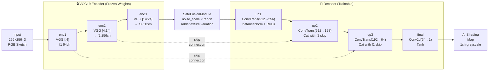
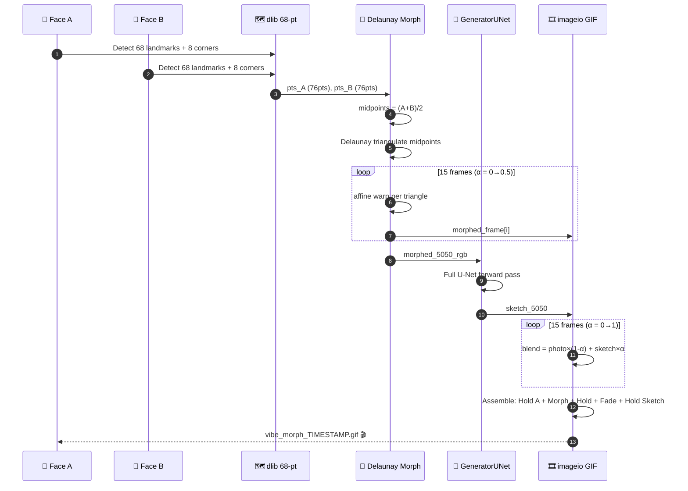
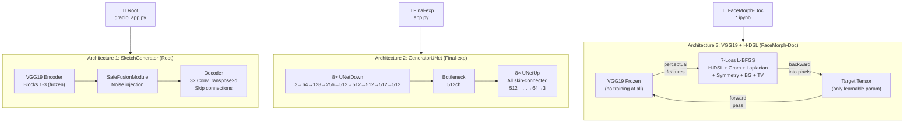

<div align="center">

```
██████╗ ███████╗    ███████╗████████╗██╗   ██╗██╗      ███████╗      ██████╗  █████╗ ███╗   ██╗
██╔══██╗██╔════╝    ██╔════╝╚══██╔══╝╚██╗ ██╔╝██║      ██╔════╝     ██╔════╝ ██╔══██╗████╗  ██║
██████╔╝███████╗    ███████╗   ██║    ╚████╔╝ ██║      █████╗       ██║  ███╗███████║██╔██╗ ██║
██╔═══╝ ╚════██║    ╚════██║   ██║     ╚██╔╝  ██║      ██╔══╝       ██║   ██║██╔══██║██║╚██╗██║
██║     ███████║    ███████║   ██║      ██║   ███████╗ ███████╗     ╚██████╔╝██║  ██║██║ ╚████║
╚═╝     ╚══════╝    ╚══════╝   ╚═╝      ╚═╝   ╚══════╝ ╚══════╝      ╚═════╝ ╚═╝  ╚═╝╚═╝  ╚═══╝
```

### *Three architectures. Two pipelines. One converged face.*

**A multi-stage research project for facial identity fusion, geometric morphing, and AI sketch generation.**  
**Evolving from a VGG19 style-transfer prototype all the way to a full face-morph GIF engine with dlib landmarks.**

---

[](https://python.org)
[](https://pytorch.org)
[](https://gradio.app)
[](http://dlib.net)
[](http://mmlab.ie.cuhk.edu.hk/projects/CelebA.html)
[]()
[](https://github.com/ajaykumarreddy-k/PS-Style-GAN-Image-Generater-for-facial-entertainment-)

</div>

---

## 📡 Where This Repo Comes From

This project is a **feature extension** of the original upstream repo:

> **[PS-Style-GAN-Image-Generater-for-facial-entertainment-](https://github.com/ajaykumarreddy-k/PS-Style-GAN-Image-Generater-for-facial-entertainment-)**  
> — The upstream project focused solely on generating **hybrid pencil sketches** from face photos using a trained VGG19 + GAN pipeline.

This fork/extension adds:

| Extension | What Was Added |
|---|---|
| **Neural Identity Fusion** | L-BFGS pixel optimization — fuse two faces without training |
| **Geometric Face Morphing** | dlib 68-point landmark triangulation + Delaunay morph |
| **GIF Export Engine** | 3-phase animated morph → sketch animation via `imageio` |
| **Advanced Loss Suite** | H-DSL, Gram-Style, Laplacian Pyramid, Symmetry, BG Anchor |
| **Multi-strength Batch Pipeline** | `enhanced_hybrid.py` — 30%, 35%, 40% blends at once |

---

## 📌 Table of Contents

1. [Project at a Glance — What Each Folder Does](#-project-at-a-glance--what-each-folder-does)
2. [Architecture Map — Solo vs Hybrid](#-architecture-map--solo-vs-hybrid)
3. [Pipeline 1 — Hybrid Sketch Generator (Root)](#-pipeline-1--hybrid-sketch-generator-root)
4. [Pipeline 2 — Face Morph + AI Sketch GIF (Final-exp)](#-pipeline-2--face-morph--ai-sketch-gif-final-exp)
5. [Pipeline 3 — Neural Identity Fusion (FaceMorph-Doc)](#-pipeline-3--neural-identity-fusion-facemorphdoc)
6. [All Three Architectures Compared](#-all-three-architectures-compared)
7. [Full Repository File Tree](#-full-repository-file-tree)
8. [Model Weights Reference](#-model-weights-reference)
9. [Setup & Run](#-setup--run)
10. [Research Contributions](#-research-contributions)
11. [Team & Credits](#-team--credits)

---

## 🗺 Project at a Glance — What Each Folder Does

```
PS-Style-GAN-Image-Generater-for-facial-entertainment-with-Features-main/
│
├── 📁 [ROOT]                     ← PIPELINE 1: Production Sketch Generator
│   ├── gradio_app.py             Gradio web UI — upload face → pencil sketch
│   ├── enhanced_hybrid.py        Batch: outputs 30%, 35%, 40% strength variants
│   ├── final_model_SHADING.pth   Trained SketchGenerator weights (46 MB)
│   └── test_face.jpg             Sample input portrait
│
├── 📁 Final-exp/                 ← PIPELINE 2: Face Morph + GIF Engine (HYBRID ARCH)
│   ├── app.py                    Full face morph → 3-phase GIF with AI sketch finale
│   ├── main.txt                  Early Adam-based prototype (VGG19 solo style transfer)
│   ├── Project_Vibe_Perfect_90.pth  GeneratorUNet weights (207 MB)
│   └── shape_predictor_68_face_landmarks.dat  dlib landmarks model (96 MB)
│
├── 📁 Final-somewhatfacemorph/   ← THIS FOLDER (you are here)
│   └── 📁 FaceMorph-Doc/        ← PIPELINE 3: Kaggle L-BFGS Neural Fusion
│       ├── Project_Vibe_Final_SRM.ipynb  Main notebook (V1→V7 + GAN)
│       ├── workingcode.txt       Standalone clean implementation
│       ├── project_vibe_optimized_weights.pt  H-DSL module weights (770 KB)
│       └── project_vibe_final_sketch.png  Sample pencil sketch output
│
├── 📁 Kaggle-saves/              ← Saved model checkpoints from Kaggle training
│   ├── Project_Vibe_Final.pth   Full U-Net weights (207 MB)
│   ├── cdsm_morph_v1_post_gym.pth  CDSM morph model (25 MB)
│   └── 1.main-pre.ipynb         Pre-training notebook
│
├── 📁 hmm/                      ← Experimental branch (older nahnahnahnah experiments)
├── 📁 Main - Diagram - Archi/   ← Architecture diagram assets
└── 📁 .venv/                    ← Python virtual environment
```

---

## 🏗 Architecture Map — Solo vs Hybrid

The project uses **three distinct neural architectures** across its sub-systems. Here's how they compare at the top level:

```
╔═══════════════════════════════════════════════════════════════════════════╗
║                    ARCHITECTURE CLASSIFICATION MAP                        ║
╠═══════════════════════════════╦═══════════════════════════════════════════╣
║  SOLO ARCHITECTURES           ║  HYBRID ARCHITECTURES                     ║
║  (single model end-to-end)    ║  (CV2 algorithm + neural model combined)  ║
╠═══════════════════════════════╬═══════════════════════════════════════════╣
║                               ║                                           ║
║  GeneratorUNet (Final-exp)    ║  SketchGenerator (Root Pipeline)          ║
║  ─────────────────────────    ║  ─────────────────────────────────────    ║
║  Pure 8-layer U-Net, trained  ║  VGG19 Encoder (frozen) + SafeFusion     ║
║  on face→face translation.    ║  Module + Decoder with skip connections.  ║
║  Takes face A+B → morped face.║  CV2 color-dodge sketch + AI shading.    ║
║                               ║                                           ║
║  VGG19 Style Transfer (Proto) ║  Neural Identity Fusion (FaceMorph-Doc)  ║
║  ─────────────────────────    ║  ─────────────────────────────────────   ║
║  Frozen VGG19 + Adam          ║  Frozen VGG19 feature extractor +        ║
║  optimizer on target pixel.   ║  L-BFGS pixel optimization +             ║
║  earliest prototype.          ║  7 custom loss functions. Hybrid          ║
║                               ║  of classical CV and neural losses.       ║
╚═══════════════════════════════╩═══════════════════════════════════════════╝
```

### Quick Decision Guide: Which Folder/Script to Use?

| Goal | Use This | Where |
|---|---|---|
| Generate pencil sketch from ONE face photo | `gradio_app.py` | Root |
| Batch generate 30/35/40% sketch variants | `enhanced_hybrid.py` | Root |
| Morph TWO faces + export as animated GIF | `Final-exp/app.py` | Final-exp |
| Fuse two face identities (research, Kaggle) | `FaceMorph-Doc/*.ipynb` | Final-somewhatfacemorph/FaceMorph-Doc |
| Study the earliest prototype / Adam version | `Final-exp/main.txt` | Final-exp |

---

## 🎨 Pipeline 1 — Hybrid Sketch Generator (Root)

> **Architecture: HYBRID** — CV2 Color-Dodge Algorithm + VGG19-GAN Neural Shading

This is the **production pipeline** — the evolution of the upstream PS-Style-GAN. It runs via `gradio_app.py` and uses a 3-step hybrid approach:

```
╔═══════════════════════════════════════════════════════════════════╗
║           PIPELINE 1: HYBRID SKETCH GENERATOR                     ║
║           gradio_app.py + enhanced_hybrid.py                       ║
╠═══════════════════════════════════════════════════════════════════╣
║                                                                   ║
║   INPUT: Any portrait photo (PIL RGB)                             ║
║       │                                                           ║
║       ▼                                                           ║
║   ┌─────────────────────────────────────────────────────────┐    ║
║   │  STEP 1: CV2 Color-Dodge Line Art                        │    ║
║   │                                                          │    ║
║   │  RGB → Grayscale                                         │    ║
║   │  → Histogram Equalization (contrast boost)              │    ║
║   │  → Invert: inv = 255 − gray                             │    ║
║   │  → GaussianBlur(inv, kernel=(37,37))                    │    ║
║   │  → color-dodge: gray / (255 − blur) × 256               │    ║
║   │  → Sharpen kernel (5.0 center, -0.5 neighbors)          │    ║
║   │         ↓                                                │    ║
║   │     sketch_cv2  (sharp mathematical lines)              │    ║
║   └──────────────────────────────┬──────────────────────────┘    ║
║                                  │                                ║
║   ┌──────────────────────────────▼──────────────────────────┐    ║
║   │  STEP 2: SketchGenerator — AI Shading Enhancement        │    ║
║   │                                                          │    ║
║   │  ┌─────────────────────────────────────────────────┐    │    ║
║   │  │          SketchGenerator Architecture            │    │    ║
║   │  │   (VGG19 Encoder → SafeFusion → Decoder)        │    │    ║
║   │  │                                                  │    │    ║
║   │  │  sketch_cv2 → RGB → Resize(256×256) → Norm      │    │    ║
║   │  │       │                                          │    │    ║
║   │  │   ENCODER (Frozen VGG19 features)               │    │    ║
║   │  │   enc1: VGG layers [:4]   → f1 (64ch)           │    │    ║
║   │  │   enc2: VGG layers [4:14] → f2 (256ch)          │    │    ║
║   │  │   enc3: VGG layers[14:24] → f3 (512ch)          │    │    ║
║   │  │       │                                          │    │    ║
║   │  │   SafeFusionModule (noise injection)             │    │    ║
║   │  │   noise_scale × randn → adds texture variation  │    │    ║
║   │  │       │                                          │    │    ║
║   │  │   DECODER (Trainable)                           │    │    ║
║   │  │   up1: ConvTranspose2d(512→256) + InstanceNorm  │    │    ║
║   │  │   up2: ConvTranspose2d(512→128) + skip f2       │    │    ║
║   │  │   up3: ConvTranspose2d(192→64)  + skip f1       │    │    ║
║   │  │   final: Conv2d(64→1) + Tanh                    │    │    ║
║   │  │       │                                          │    │    ║
║   │  │       ▼  generated (AI shading map)             │    │    ║
║   │  └─────────────────────────────────────────────────┘    │    ║
║   │                                                          │    ║
║   │  Contrast enhance: alpha=1.15, beta=-10                  │    ║
║   └──────────────────────────────┬──────────────────────────┘    ║
║                                  │                                ║
║   ┌──────────────────────────────▼──────────────────────────┐    ║
║   │  STEP 3: Weighted Blend                                  │    ║
║   │                                                          │    ║
║   │  final = α × AI_shading  +  (1−α) × sketch_cv2          │    ║
║   │  α = ai_strength / 100.0   (default: 35% = 0.35)        │    ║
║   │  + Final contrast: alpha=1.05                            │    ║
║   └──────────────────────────────┬──────────────────────────┘    ║
║                                  ▼                                ║
║   OUTPUT: Hybrid pencil sketch PNG                                ║
║   BEST PRESET: ENHANCED_35 (blur=18, strength=35%)               ║
╚═══════════════════════════════════════════════════════════════════╝
```

### SketchGenerator — Neural Architecture Detail



**ENHANCED_35 Configuration (Production Default)**

| Parameter | Value | Reason |
|---|---|---|
| Blur Kernel | 18 | Sharper than original 21 — crisper edge definition |
| AI Strength | 35% | Mathematical precision + artistic shading balance |
| Histogram Eq. | ON | Better contrast handling for varied lighting |
| Sharpening | 5.0× center | Crisper line edges post color-dodge |
| AI Contrast | 1.15× | Deeper shading from AI output |
| Final Contrast | 1.05× | Subtle overall depth boost |

---

## 🎭 Pipeline 2 — Face Morph + AI Sketch GIF (Final-exp)

> **Architecture: HYBRID** — dlib Geometric Morphing + GeneratorUNet AI Sketch  
> **Script:** `Final-exp/app.py`

This pipeline takes **two face photos** and exports a **3-phase animated GIF**: geometric morph → hold the merged face → crossfade to AI sketch.

```
╔═══════════════════════════════════════════════════════════════════════╗
║           PIPELINE 2: FACE MORPH + AI SKETCH GIF ENGINE               ║
║           Final-exp/app.py                                             ║
╠═══════════════════════════════════════════════════════════════════════╣
║                                                                       ║
║   INPUT: Face A + Face B (portrait JPG/PNG)                          ║
║                                                                       ║
║  ┌────────────────────────────────────────────────────────────────┐  ║
║  │  PHASE 0: Landmark Detection (dlib)                            │  ║
║  │                                                                │  ║
║  │  dlib HOG face detector → bounding box                        │  ║
║  │  shape_predictor_68 → 68 facial keypoints per face            │  ║
║  │  + 8 corner anchor points = 76 total triangulation points     │  ║
║  │                                                                │  ║
║  │   Points:  eyes(12) + brows(10) + nose(9) + lips(20)         │  ║
║  │            jaw(17) + corners(8) = 76 total                    │  ║
║  └───────────────────────────────┬────────────────────────────────┘  ║
║                                  │                                    ║
║  ┌───────────────────────────────▼────────────────────────────────┐  ║
║  │  PHASE 1: Delaunay Triangulation + Geometric Morph             │  ║
║  │                                                                │  ║
║  │  Midpoint mesh = (pts_A + pts_B) / 2                          │  ║
║  │  cv2.Subdiv2D → triangle_list (Delaunay tessellation)         │  ║
║  │                                                                │  ║
║  │  For each frame i in [0 … num_frames]:                        │  ║
║  │    alpha = (i / num_frames) × 0.5   ← stops at 50%           │  ║
║  │    morphed_pts = (1−α) × pts_A + α × pts_B                   │  ║
║  │    Per triangle:                                               │  ║
║  │      affine_transform(srcA_triangle → morphed_triangle)       │  ║
║  │      affine_transform(srcB_triangle → morphed_triangle)       │  ║
║  │      blend = (1−α)×warpA + α×warpB                           │  ║
║  │                                                                │  ║
║  │  → 15 frames: Face A → 50/50 blended face                    │  ║
║  └───────────────────────────────┬────────────────────────────────┘  ║
║                                  │                                    ║
║  ┌───────────────────────────────▼────────────────────────────────┐  ║
║  │  PHASE 2: GeneratorUNet — AI Sketch of Morphed Face            │  ║
║  │                                                                │  ║
║  │  ┌──────────────────────────────────────────────────────────┐ │  ║
║  │  │         GeneratorUNet (8 Down + 8 Up = Full U-Net)       │ │  ║
║  │  │                                                          │ │  ║
║  │  │  down1(3→64)  down2(64→128)  down3(128→256)             │ │  ║
║  │  │  down4(256→512,drop) down5(512→512,drop)                 │ │  ║
║  │  │  down6(512→512,drop) down7(512→512,drop)                 │ │  ║
║  │  │  down8(512→512,drop) ← bottleneck                       │ │  ║
║  │  │                                                          │ │  ║
║  │  │  up1(512→512) + skip d7   up2(1024→512) + skip d6       │ │  ║
║  │  │  up3(1024→512) + skip d5   up4(1024→512) + skip d4      │ │  ║
║  │  │  up5(1024→256) + skip d3  up6(512→128) + skip d2        │ │  ║
║  │  │  up7(256→64) + skip d1                                   │ │  ║
║  │  │  final: Upsample + Conv(128→3) + Tanh                    │ │  ║
║  │  └──────────────────────────────────────────────────────────┘ │  ║
║  │                                                                │  ║
║  │  Crossfade: 15 frames  //  blended = (1−α)×photo + α×sketch  │  ║
║  └───────────────────────────────┬────────────────────────────────┘  ║
║                                  │                                    ║
║  ┌───────────────────────────────▼────────────────────────────────┐  ║
║  │  PHASE 3: GIF Assembly (imageio)                               │  ║
║  │                                                                │  ║
║  │  [Hold Face A: 12 frames]                                     │  ║
║  │  [Morph A → 50/50: 15 frames]                                 │  ║
║  │  [Hold 50/50 Face: 15 frames]   ← "see the new person"       │  ║
║  │  [Crossfade to AI Sketch: 15 frames]                          │  ║
║  │  [Hold Sketch: 30 frames]                                     │  ║
║  │  Total: ~87 frames @ 12fps = ~7.3 seconds, loop=0 (infinite) │  ║
║  └───────────────────────────────┬────────────────────────────────┘  ║
║                                  ▼                                    ║
║   OUTPUT: vibe_morph_{timestamp}.gif                                  ║
╚═══════════════════════════════════════════════════════════════════════╝
```



---

## 🔬 Pipeline 3 — Neural Identity Fusion (FaceMorph-Doc)

> **Architecture: HYBRID** — Frozen VGG19 Perceptual Backbone + L-BFGS Pixel Optimization  
> **Notebooks:** `FaceMorph-Doc/Project_Vibe_Final_SRM.ipynb` (7 versions)  
> **Designed for:** Kaggle / Colab with GPU

This is the **academic research pipeline** — no trained generator, no face detection. The output image tensor itself is the only learnable parameter.

```
╔═══════════════════════════════════════════════════════════════════════╗
║         PIPELINE 3: NEURAL IDENTITY FUSION (Kaggle / Research)        ║
║         FaceMorph-Doc/Project_Vibe_Final_SRM.ipynb                    ║
╠═══════════════════════════════════════════════════════════════════════╣
║                                                                       ║
║   INPUT: Sub1 (Structure Face) + Sub2 (Identity Face) from CelebA    ║
║                                                                       ║
║  ┌─────────────────────────────────────────────────────────────────┐ ║
║  │  STEP 1: Zoned Spatial Masking                                  │ ║
║  │                                                                 │ ║
║  │  dist = ((Y−0.42)/0.38)² + ((X−0.5)/0.28)²                   │ ║
║  │  core_mask = clamp(1 − dist/0.18, 0,1)  ← eyes, nose tight    │ ║
║  │  full_mask = clamp(1 − dist, 0,1)        ← full face ellipse   │ ║
║  │  bg_mask   = 1 − full_mask               ← hair, background    │ ║
║  └─────────────────────────────────────────────────────────────────┘ ║
║                                                                       ║
║  ┌─────────────────────────────────────────────────────────────────┐ ║
║  │  STEP 2: VGG19 Pre-computation on Sub2 (no_grad)                │ ║
║  │                                                                 │ ║
║  │  Layer 3  → s1  (edges)     Layer 8  → s2 (fine texture)       │ ║
║  │  Layer 14 → s3  (mid)       Layer 17 → s4 (high style)         │ ║
║  │  Layer 21 → c1  ⭐ (identity content — primary hook)           │ ║
║  │  Layer 26 → c2  (deep)      Layer 30 → c3 (semantics)          │ ║
║  └─────────────────────────────────────────────────────────────────┘ ║
║                                                                       ║
║  ┌─────────────────────────────────────────────────────────────────┐ ║
║  │  STEP 3: Target Init + L-BFGS Optimization                      │ ║
║  │                                                                 │ ║
║  │  target = 0.65×Sub1 + 0.35×Sub2                               │ ║
║  │  target.requires_grad = True  ← ONLY learnable param           │ ║
║  │                                                                 │ ║
║  │  12–15 outer batches × 25 inner L-BFGS steps  =  ~375 total   │ ║
║  │                                                                 │ ║
║  │  COMPOSITE LOSS (7 terms):                                      │ ║
║  │  ① Content  : MSE(feat_c1..c3, sub2_feats)       × 8–15       │ ║
║  │  ② Style    : MSE(Gram(s1..s4), Gram(sub2))      × 2k–20k     │ ║
║  │  ③ H-DSL    : Sobel cosine angle diff vs Sub1    × 1.2k–2.5k  │ ║
║  │  ④ Laplacian: 3-level pyramid MSE on core zone   × 2k–3k      │ ║
║  │  ⑤ Symmetry : MSE(core, flip(core))              × 400–500    │ ║
║  │  ⑥ BG Anchor: MSE(bg_zone, sub1_bg)              × 600–1.2k   │ ║
║  │  ⑦ TV/Smooth: L1.25 total variation              × 3–45       │ ║
║  └─────────────────────────────────────────────────────────────────┘ ║
║                                                                       ║
║   OUTPUT: Fused face PNG + Pencil Sketch + Spatial Zone Map          ║
╚═══════════════════════════════════════════════════════════════════════╝
```

### Version Evolution in `Project_Vibe_Final_SRM.ipynb`

| Cell | Version | Key Algorithm Change |
|---|---|---|
| Cell 1 | **V1 — Baseline** | Simple ellipse mask, 3-layer VGG hooks, Adam → L-BFGS |
| Cell 2 | **V2 — Zoned Masks** | `core / full / bg` split, BG anchor loss, zone map visual |
| Cell 3 | **V3 — Multi-Content** | c1+c2+c3 hooks, weighted s3,s4 (×0.8), symmetry loss |
| Cell 4 | **V4 — CDSM** | Tighter core (r=0.20), rebalanced weights, presentation output |
| Cell 5 | **V5 — SRM Final** | **Laplacian pyramid**, full 7-loss suite, r=0.18 core |
| Cell 6 | **V6 — GAN Branch** | U-Net generator + PatchGAN discriminator + CelebA DataLoader |
| Cell 7 | **V7 — Flawless** | `edge_preserving_smoothness()` L1.25, dpi=200, strongest weights |

---

## ⚔️ All Three Architectures Compared



| Dimension | SketchGenerator (Root) | GeneratorUNet (Final-exp) | VGG19 + L-BFGS (FaceMorph-Doc) |
|---|---|---|---|
| **Type** | Hybrid (CV2 + neural) | Solo (pure neural) | Hybrid (perceptual + optimization) |
| **Input** | 1 face photo | 2 faces | 2 faces (CelebA) |
| **Output** | Pencil sketch PNG | Animated morph GIF | Fused face PNG + sketch |
| **Training needed** | Pre-trained `.pth` (46 MB) | Pre-trained `.pth` (207 MB) | **None** (zero-shot) |
| **Face detection** | None | dlib 68-point landmarks | None |
| **Optimizer** | Trained offline | Trained offline | L-BFGS (runtime) |
| **Speed** | ~1–3s inference | ~5–10s GIF render | ~2min optimization |
| **Skip connections** | Yes (3 levels) | Yes (8 levels — full U-Net) | N/A |
| **Novel losses** | None | None | H-DSL + Laplacian + Symmetry |
| **Deployment** | Gradio web app | Gradio web app | Kaggle / Colab notebook |

---

## 📂 Full Repository File Tree

```
PS-Style-GAN-Image-Generater-for-facial-entertainment-with-Features-main/
│
├── gradio_app.py                         # Gradio web app — ENHANCED_35 hybrid sketch
│   └── class SketchGenerator             #   VGG19 enc1/enc2/enc3 + SafeFusion + decoder
│   └── def create_enhanced_sketch()      #   3-step: CV2 → AI → Blend
│
├── enhanced_hybrid.py                    # Batch pipeline — 30/35/40% variants
├── final_model_SHADING.pth               # SketchGenerator weights (46 MB)
├── hybrid_result_ENHANCED_35.png         # Sample output at 35% blend
├── test_face.jpg                         # Sample input portrait
├── requirements.txt                      # torch≥2.0, torchvision, opencv, gradio
├── README.md                             # Root readme (production quick-start)
│
├── Final-exp/
│   ├── app.py                            # Face morph GIF engine — THE BIG APP
│   │   ├── class UNetDown / UNetUp       #   U-Net building blocks
│   │   ├── class GeneratorUNet           #   8-layer full U-Net encoder-decoder
│   │   ├── def get_landmarks()           #   dlib HOG + 68-point predictor
│   │   ├── def morph_triangle()          #   Affine warp per Delaunay triangle
│   │   └── def generate_morph()          #   3-phase GIF: Morph→Hold→Sketch
│   ├── main.txt                          # PROTOTYPE — Adam VGG19 style transfer
│   │   ├── class DirectionalStrokeLoss   #   VGG19 feature extraction prototype
│   │   └── Adam optimizer (400 steps)    #   Earliest iteration, lr=0.03
│   ├── Project_Vibe_Perfect_90.pth       # GeneratorUNet weights (207 MB)
│   ├── shape_predictor_68_face_landmarks.dat  # dlib model (96 MB)
│   ├── vibe_morph.gif                    # Example output GIF
│   └── vibe_morph_*.gif                  # Timestamped GIF outputs
│
├── Final-somewhatfacemorph/              # ← YOU ARE HERE
│   ├── README.md                         # This file
│   └── FaceMorph-Doc/
│       ├── Project_Vibe_Final_SRM.ipynb  # MAIN: V1→V7 + GAN (7 complete pipelines)
│       ├── Project_Vibe_Official_Submission.ipynb  # Clean submission version (1 KB)
│       ├── nahnahnahnahnah.ipynb         # Research scratchpad (7.6 MB, heavy outputs)
│       ├── workingcode.txt               # Standalone clean reference implementation
│       ├── project_vibe_metadata.json    # Final run config (optimizer, losses, status)
│       ├── project_vibe_optimized_weights.pt   # H-DSL module weights (770 KB)
│       ├── project_vibe_final_sketch.png # Sample pencil sketch output
│       └── vertopal.com_nahnahnahnahnah.pdf  # PDF export of experiments (~1.8 MB)
│
├── Kaggle-saves/
│   ├── Project_Vibe_Final.pth            # Full U-Net saved from Kaggle (207 MB)
│   ├── cdsm_morph_v1_post_gym.pth        # CDSM morph model checkpoint (25 MB)
│   └── 1.main-pre.ipynb                  # Pre-training notebook
│
├── hmm/
│   ├── nahnahnahnahnah.ipynb             # Older experiment copy (4.3 MB)
│   └── download.png                      # Test image
│
├── Main - Diagram - Archi/
│   └── Gemini_Generated_Image_*.png      # Architecture diagram (Gemini-generated)
│
├── Batch12 review 1 ppt.pptx             # Presentation slides
└── .venv/                                # Python virtual environment
```

---

## 💾 Model Weights Reference

| File | Size | Architecture | Used By |
|---|---|---|---|
| `final_model_SHADING.pth` | 46 MB | SketchGenerator (VGG19 enc → decoder) | `gradio_app.py`, `enhanced_hybrid.py` |
| `Project_Vibe_Perfect_90.pth` | 207 MB | GeneratorUNet (8-layer full U-Net) | `Final-exp/app.py` |
| `Kaggle-saves/Project_Vibe_Final.pth` | 207 MB | GeneratorUNet (Kaggle copy) | Backup / reload |
| `Kaggle-saves/cdsm_morph_v1_post_gym.pth` | 25 MB | CDSM morph model (v1) | Research / experimental |
| `FaceMorph-Doc/project_vibe_optimized_weights.pt` | 770 KB | HierarchicalDSL module only | L-BFGS pipeline inference |
| `shape_predictor_68_face_landmarks.dat` | 96 MB | dlib shape predictor | `Final-exp/app.py` |

---

## ⚙️ Setup & Run

### Requirements

```bash
pip install torch>=2.0.0 torchvision>=0.15.0
pip install opencv-python>=4.8.0 Pillow>=10.0.0
pip install gradio>=4.0.0
pip install dlib imageio numpy
```

> **dlib on Linux:** `pip install dlib` requires `cmake` and `libopenblas`:  
> `sudo apt-get install cmake libopenblas-dev`

---

### Option A — Run Production Sketch Generator (Root Pipeline)

```bash
# Launch Gradio web app
python gradio_app.py
# → http://localhost:7860

# Or run batch processing (saves 3 variants)
python enhanced_hybrid.py
# → hybrid_result_ENHANCED_30/35/40.png
```

---

### Option B — Run Face Morph GIF Engine (Final-exp)

```bash
cd Final-exp
python app.py
# → http://0.0.0.0:7860
# Upload two portrait photos → get animated GIF
```

---

### Option C — Run Neural Fusion (FaceMorph-Doc, Kaggle)

1. Upload `FaceMorph-Doc/Project_Vibe_Final_SRM.ipynb` to Kaggle
2. Add **CelebA dataset** via **+ Add Data** sidebar
3. Enable **GPU (T4/P100)**
4. Run the last cell (V7 Flawless — recommended)

```python
# Local override for img_dir
img_dir = '/path/to/celeba/img_align_celeba'
```

---

### Load Pre-trained Weights

```python
# SketchGenerator (Pipeline 1)
from gradio_app import SketchGenerator
import torch
netG = SketchGenerator()
netG.load_state_dict(torch.load('final_model_SHADING.pth', map_location='cpu'))
netG.eval()

# GeneratorUNet (Pipeline 2)
from Final_exp.app import GeneratorUNet
model = GeneratorUNet()
model.load_state_dict(torch.load('Final-exp/Project_Vibe_Perfect_90.pth', map_location='cpu'))
model.eval()

# H-DSL Module (Pipeline 3)
from workingcode import HierarchicalDSL
hdsl = HierarchicalDSL()
hdsl.load_state_dict(torch.load('FaceMorph-Doc/project_vibe_optimized_weights.pt', map_location='cpu'))
hdsl.eval()
```

---

## 🔬 Research Contributions

These are the **novel, original contributions** introduced in this project beyond the upstream repo:

| Contribution | Details |
|---|---|
| **H-DSL (Hierarchical Directional Stroke Loss)** | Sobel cosine angle field — penalizes edge direction mismatch, weighted by reference edge magnitude. Preserves bone structure of Face A while absorbing identity of Face B |
| **3-Zone Spatial Masking** | Mathematically-defined elliptical zones (core / full / bg) apply independent loss budgets to face regions |
| **Symmetry Regularization** | `MSE(core, flip(core))` — prevents left-right warping during identity injection |
| **Laplacian Pyramid Consistency** | Multi-scale (256→128→64) MSE enforces structural fidelity at all zoom levels |
| **Target-as-Parameter Optimization** | The output pixel tensor has `requires_grad=True` — no generator needed; VGG19 is never trained |
| **3-Phase GIF Morphing Engine** | Geometric landmark morph → hold → AI sketch crossfade, assembled with `imageio`, infinite loop |
| **Dual-Mode Design** | Same project contains both a zero-shot solver (L-BFGS) AND a full U-Net GAN training loop |

---

## 👥 Team & Credits

| Person | Role |
|---|---|
| **Ajay Kumar Reddy K** | Project Lead — Architecture design, training, deployment |
| **Sameer Raja E** | Member — Research & experiments |
| **Jeshiba Fedorah** | Member — Research & experiments |
| **Thanvarshini V R** | Member — Research & experiments |

### Academic References

| Concept | Source |
|---|---|
| VGG19 Backbone | Simonyan & Zisserman (2014) — *Very Deep CNNs for Large-Scale Image Recognition* |
| Neural Style Transfer | Gatys, Ecker & Bethge (2015) — *A Neural Algorithm of Artistic Style* |
| Gram Matrix Style | Gatys et al. (2016) — *Image Style Transfer Using CNNs*, CVPR |
| L-BFGS Optimizer | Liu & Nocedal (1989) — *On the limited memory BFGS method* |
| PatchGAN / Pix2Pix | Isola et al. (2017) — *Image-to-Image Translation with cGANs*, CVPR |
| CelebA Dataset | Liu et al. (2015) — *Deep Learning Face Attributes in the Wild*, ICCV |
| dlib Face Landmarks | King (2009) — *Dlib-ml: A Machine Learning Toolkit*, JMLR |
| U-Net Architecture | Ronneberger et al. (2015) — *U-Net: Convolutional Networks for Biomedical Segmentation* |

---

<div align="center">

---

```
  Upstream: PS-Style-GAN  →  Extended with face morphing, identity fusion,
  dlib landmarks, GIF export, L-BFGS optimization, and 7 custom loss terms.

  Three architectures.  Three pipelines.  One converged research project.
```


*PS-Style GAN Image Generator for Facial Entertainment with Features*

[↗ Upstream Repo](https://github.com/ajaykumarreddy-k/PS-Style-GAN-Image-Generater-for-facial-entertainment-)

</div>
